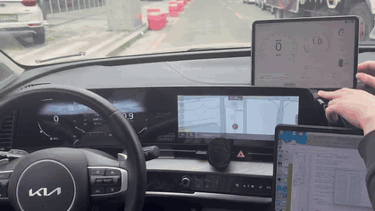
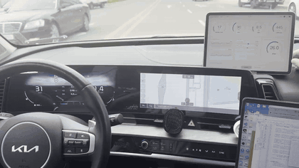
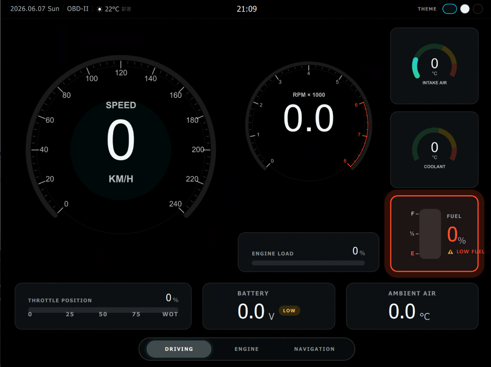
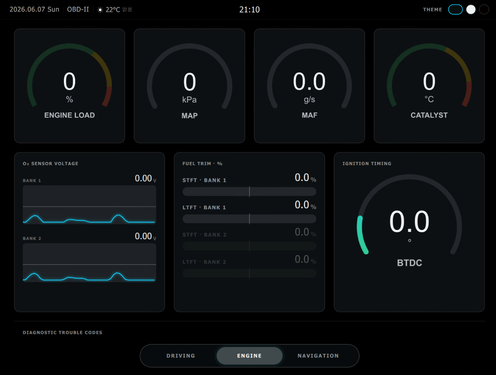
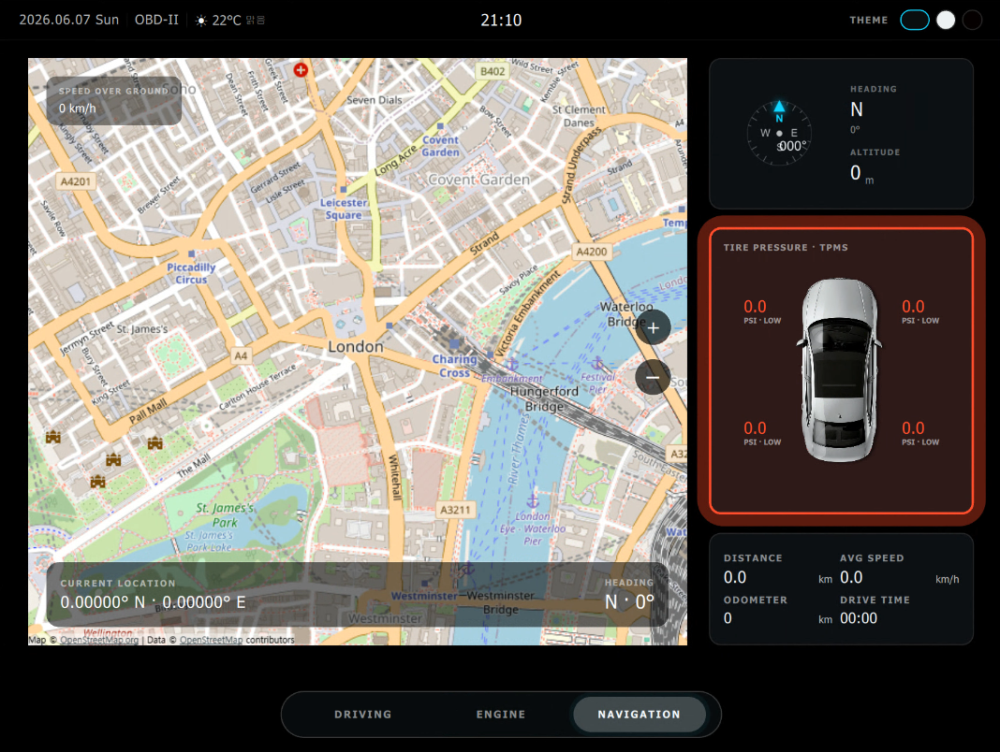
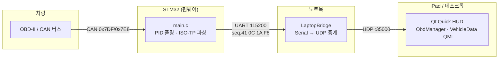
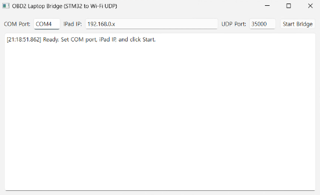

# OBD-II HUD

차량 OBD-II 데이터를 실시간으로 수집해 무선으로 전송하고, iPad/데스크톱용 Qt Quick HUD(Head-Up Display)에 시각화하는 차량 계기판 프로젝트입니다.

> STM32(CAN) → 노트북 브리지(Serial→UDP) → Qt Quick HUD 로 이어지는 엔드투엔드 텔레메트리 파이프라인.

## 데모

| 주행 화면 | 엔진 화면 |
| --- | --- |
|  |  |

| Page 1 — Driving | Page 2 — Engine | Page 3 — Nav |
| --- | --- | --- |
|  |  |  |

> 위 GIF는 demo 영상에서 추출한 일부 구간입니다. 실차/시뮬레이션 풀 영상은 별도 제공.

## 개요

자동차의 OBD-II 진단 포트에서 엔진 RPM, 속도, 냉각수 온도, 연료, 흡기/촉매 온도 등
수십 종의 PID(Parameter ID)를 읽어 운전석에서 보기 좋은 HUD로 띄우는 것이 목표입니다.

물리적으로 분리된 4개의 레이어가 한 줄(line) 단위의 텍스트 프로토콜로 느슨하게 연결되어 있어,
각 레이어를 독립적으로 개발·교체·테스트할 수 있습니다.

### 핵심 기능

- **OBD-II PID 디코딩**: 표준 Mode 01 PID 40여 종을 물리값으로 변환(RPM, 속도, 온도, 연료, 람다/AFR, 촉매 온도, 토크 등).
- **무선 텔레메트리**: STM32가 UART로 내보낸 프레임을 노트북 브리지가 UDP(브로드캐스트 또는 지정 IP)로 중계 → 차량 안에서 케이블 없이 iPad에 표시.
- **시퀀스 기반 패킷 정합성**: 시퀀스 번호로 순서가 뒤바뀐 UDP 패킷을 폐기하고, STM32 재부팅(시퀀스 리셋)도 감지.
- **DTC(고장 코드) 표시**: 별도 `DTCS:` 라인으로 진단 코드/설명/심각도를 받아 경고 UI에 반영.
- **GPS / 환경 정보**: Qt Positioning으로 위치·방위·고도를, OpenWeatherMap으로 날씨를 가져와 HUD에 통합.
- **테마 전환 가능한 다중 HUD UI**: 주행/엔진/내비 3페이지 구성, 런타임 테마 변경(`T` 키).

## 시스템 아키텍처



**데이터 흐름**

1. STM32가 20ms 주기로 `0x7DF`(OBD 브로드캐스트) 요청을 보내고, `0x7E8~0x7EF` 응답의 ISO-TP 단일 프레임을 파싱해 `시퀀스번호,41 0C 1A F8\n` 형태로 UART 출력.
2. `LaptopBridge`가 시리얼 포트를 읽어 `\n` 단위로 한 줄씩 재조립한 뒤 UDP로 중계(기본 포트 35000, 잘못된 IP면 브로드캐스트).
3. HUD 앱의 `ObdManager`가 UDP 35000을 바인딩해 수신 → 시퀀스 검증 → `ObdParser`가 PID를 물리값으로 변환 → `VehicleData`가 변경된 값만 시그널로 emit → QML 바인딩으로 화면 갱신.

## 기술 스택

| 레이어 | 스택 |
| --- | --- |
| HUD 앱 | C++17, Qt 6.5+ (Quick / Network / Positioning / Location), QML, CMake |
| 노트북 브리지 | C++17, Qt 6 (Widgets / SerialPort / Network), CMake |
| 펌웨어 | C, STM32 HAL (CAN, USART) |
| 디자인 프로토타입 | React/JSX + HTML (`hud2/`, `kpi/`) |

## 설계 하이라이트 / 엔지니어링 결정

- **라인 기반 텍스트 프로토콜로 레이어 분리**: 바이너리 대신 사람이 읽을 수 있는 `seq,hex...` / `KEY:VALUE` 라인을 사용해, 각 단계를 터미널·로그로 바로 디버깅할 수 있게 했습니다. 브리지·HUD를 펌웨어 없이도 단독 테스트 가능.
- **두 가지 입력 파서**: `ObdParser`는 ELM327식 16진 응답(`41 0C 1A F8`)과 간이 `RPM:2500,SPD:80` 라인을 모두 처리해, 실제 어댑터/STM32/목업 데이터를 같은 코드 경로로 받습니다.
- **UDP 순서/재부팅 처리**: 무선 UDP 특성상 발생하는 순서 뒤바뀜을 시퀀스 번호로 폐기하되, 값이 크게 작아지면 MCU 재부팅으로 간주해 시퀀스를 다시 받아들입니다.
- **변경분만 emit**: `VehicleData`는 이전 값과 다를 때만 해당 프로퍼티 시그널을 발생시켜 QML 바인딩 갱신과 리렌더링을 최소화.
- **iPad 우선 레이아웃**: iPad Pro 11인치 논리 해상도(1194×834) 기준으로 설계하고 iOS에서는 풀스크린, GPS 권한은 UI 로드 이후 요청하도록 분리.

## 내 담당

팀 프로젝트이며, 본 레포에서 제가 담당한 범위는 다음과 같습니다.

- **Qt Quick HUD 앱 — C++ 백엔드** (`src/`): `ObdManager`(UDP 수신·시퀀스 검증·DTC 파싱), `ObdParser`(PID 디코딩), `VehicleData`(QML 바인딩·GPS), `WeatherData`, `Clock`, `ThemeManager`.
- **HUD UI — QML** (`qml/`): 주행/엔진/내비 페이지, 게이지 컴포넌트, 테마 시스템.
- **노트북 브리지** (`LaptopBridge/`): 시리얼 → UDP 중계 데스크톱 앱.
- **디자인 프로토타입** (`hud2/`, `kpi/`): QML 포팅 전 React/HTML 목업.

> STM32 펌웨어(`main.c`, CAN/OBD-II 폴링)는 팀원이 담당했습니다.

## 실행 방법

### 1) HUD 앱 (Qt Quick)

요구사항: Qt 6.5 이상(Quick, Network, Positioning, Location), CMake 3.16+, C++17 컴파일러.

```bash
cmake -S . -B build -DCMAKE_PREFIX_PATH=<Qt 설치 경로>
cmake --build build --target HudProject
```

- 실행하면 자동으로 UDP 35000 포트를 열어 텔레메트리를 수신합니다.
- 단축키: `F11` 전체화면, `T` / `Shift+T` 테마 변경.
- 날씨 기능을 쓰려면 `src/main.cpp`의 `WeatherData("YOUR_API_KEY", ...)` 자리에
  본인의 [OpenWeatherMap](https://openweathermap.org/api) API 키를 넣으세요(키 없이도 HUD는 동작).

### 2) 노트북 브리지 (Serial → UDP)

요구사항: Qt 6(Widgets, SerialPort, Network).



```bash
cmake -S LaptopBridge -B LaptopBridge/build -DCMAKE_PREFIX_PATH=<Qt 설치 경로>
cmake --build LaptopBridge/build --target LaptopBridge
```

- 실행 후 COM 포트, 대상 IP(iPad), UDP 포트(기본 35000)를 입력하고 **Start Bridge**.
- 대상 IP를 비우거나 `192.168.0.x`로 두면 브로드캐스트로 전송합니다.

### 3) STM32 펌웨어

`main.c`는 STM32 HAL 기반 펌웨어 본체로, CAN으로 OBD-II PID를 폴링해 UART(115200)로 내보냅니다.
빌드/플래시는 STM32CubeIDE 등 별도 펌웨어 프로젝트에서 진행합니다.

## 알려진 한계 / 향후 계획

- 빌드/플래시용 STM32CubeIDE 프로젝트 전체가 아니라 핵심 `main.c`만 포함되어 있습니다.
- UDP는 기본 평문 브로드캐스트라 동일 네트워크 내 누구나 수신 가능 — 인증/암호화는 미구현.
- TPMS·일부 GPS 파생값(트립/주행거리)은 UI 자리만 마련되어 있고 실제 소스 연동은 부분적입니다.
- 날씨 API 키가 소스에 직접 들어가는 구조 → 환경변수/설정 파일 분리 예정.
- 자동 재연결, 단위 테스트, CI 빌드는 향후 과제.

## 트러블슈팅

### iPad 페이지 전환 렉

**증상** — iPad(디자인 해상도 2388×1668)에서 `SwipeView` 페이지 전환 애니메이션 도중 프레임이 드랍됨.

**원인** — `qml/hud2/Hud2App.qml`의 `SwipeView`(`id: viewStack`)가 `Page1Driving {}` · `Page2Engine {}` · `Page3Nav {}`를 인라인으로 선언합니다. SwipeView는 이 세 페이지를 모두 즉시 인스턴스화해 유지하므로(아래 *확인 필요* 참고), 전환 애니메이션 중 인접 페이지가 화면에 겹쳐 동시에 렌더됩니다. 각 페이지는 Canvas 기반 게이지(`ArcGauge`/`RadialGauge`/`BarGauge`/`O2Trace`)로 구성되고 `Page3Nav.qml`은 추가로 `QtLocation`의 `Map`(`id: navMap`)을 포함해, 전환 순간 이들이 한꺼번에 리페인트되면서 부하가 몰립니다.

**해결** — 코드에는 페이지별 리페인트 비용을 평상시 0에 가깝게 유지하는 장치들이 들어 있어, 전환 시 실제로 변하는 부분만 다시 그리도록 제한합니다.

- **Canvas는 값/테마 변화 시에만 `requestPaint()`** — `ArcGauge.qml`·`RadialGauge.qml`·`BarGauge.qml`은 `on_AnimValueChanged`, `on_ThemeTrackerChanged`, `onWidthChanged`/`onHeightChanged`에서만 리페인트를 트리거합니다. 표시값은 `Behavior on _animValue { NumberAnimation { duration: 300 } }`로 값이 바뀔 때만 애니메이트되므로, 값이 고정된 정적 상태에서는 매 프레임 리페인트가 발생하지 않습니다(단, 이 300ms 보간 구간에는 프레임마다 다시 그려지므로 전환과 값 갱신이 겹치면 부하가 커질 수 있음). `Page3Nav.qml`의 차량 위치 마커 `mapCanvas`도 `onHeadingChanged`에서만 `requestPaint()`를 호출합니다.
- **상시 루프 타이머는 `visible` 가드** — `O2Trace.qml`의 파형 애니메이션용 `Timer { interval: 33 }`은 `running: root.value !== null && root.visible` 조건으로 묶여 있어, 보이지 않는 위젯에서는 30fps 루프가 돌지 않습니다.
- **상시 리페인트 배경이 hud2 스킨에서 빠짐** — `qml/components/`의 `ScanlineEffect.qml`(`NumberAnimation on _pos { loops: Animation.Infinite }`)과 `BackgroundScene.qml`(무한 `NumberAnimation on _offset` + `on_OffsetChanged: requestPaint()`)은 상시 리페인트 루프지만, `qml/hud2/` 페이지들은 이들을 import/사용하지 않습니다. `Page1Driving.qml`에도 상시 글로우를 뺀 흔적(`Background glow removed as requested` 주석)이 있습니다.
- **데이터는 변경분만 emit** — `src/VehicleData.cpp`의 `applyValues()`는 `EMIT_IF` 매크로로 `이전값 != 새값`일 때만 해당 `*Changed` 시그널을 발생시킵니다. GPS는 `onPositionUpdated`에서 `info.isValid()`일 때만 `gpsChanged()`, DTC는 `m_dtcList != dtcs`일 때만 `dtcListChanged()`를 emit합니다. 값이 바뀌지 않으면 QML 바인딩 갱신·리페인트도 트리거되지 않습니다.
- **페이지 지연 로딩** — `Hud2App.qml`의 `SwipeView`는 세 페이지를 `Repeater` + `Loader`로 감싸 `asynchronous: true`로 비동기 생성하고, `active: SwipeView.isCurrentItem || SwipeView.isNextItem || SwipeView.isPreviousItem`로 현재·인접 페이지만 유지합니다. 멀리 있는 페이지(예: 1페이지에 있을 때의 3페이지)는 unload되어, 전환 중 동시에 살아 있는 Canvas 게이지·`QtLocation` `Map` 수가 줄어듭니다. 비동기 생성이라 첫 진입 시 인스턴스화가 렌더 경로를 막지 않습니다. (전환 애니메이션 동안 인접 두 페이지가 함께 보이는 것 자체는 스와이프 동작상 불가피합니다.)

## 디렉터리 구조

```
.
├── CMakeLists.txt          # HUD 앱 빌드 정의
├── main.c                  # STM32 펌웨어 (CAN OBD-II 폴링) — 팀원 담당
├── src/                    # HUD 앱 C++ 백엔드
│   ├── ObdManager.*        # UDP 수신, 시퀀스 검증, DTC 파싱
│   ├── ObdParser.*         # OBD-II PID 디코딩
│   ├── ObdValues.h         # PID 값 구조체
│   ├── VehicleData.*       # QML 바인딩 + GPS
│   ├── WeatherData.*       # OpenWeatherMap 연동
│   ├── ThemeManager.*      # 테마 전환
│   └── Clock.*             # 시계
├── qml/                    # HUD UI (QML)
│   ├── main.qml            # 진입점 (hud2 스킨 로드)
│   ├── hud2/               # 활성 HUD 스킨 (주행/엔진/내비 페이지·게이지)
│   └── components/         # 대체 HUD 스킨 컴포넌트
├── LaptopBridge/           # Serial → UDP 중계 데스크톱 앱
├── hud2/, kpi/             # React/HTML 디자인 프로토타입
├── images/                 # 앱 리소스 이미지
├── picture/                # README용 스크린샷
├── docs/                   # README용 데모 GIF
└── ios/                    # iOS Info.plist 템플릿
```
